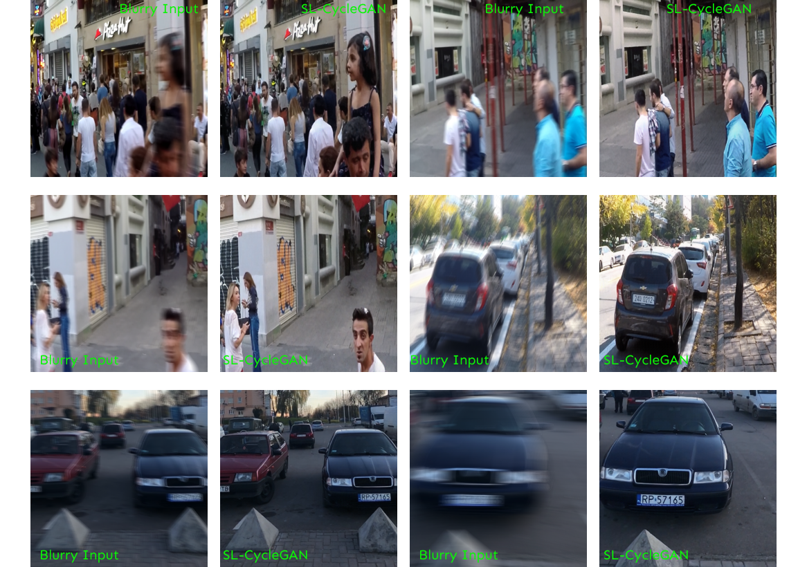
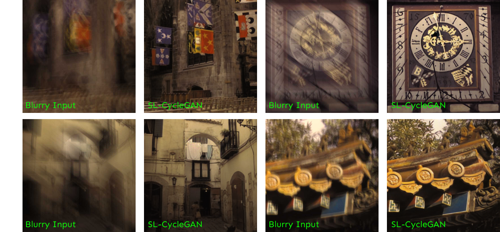
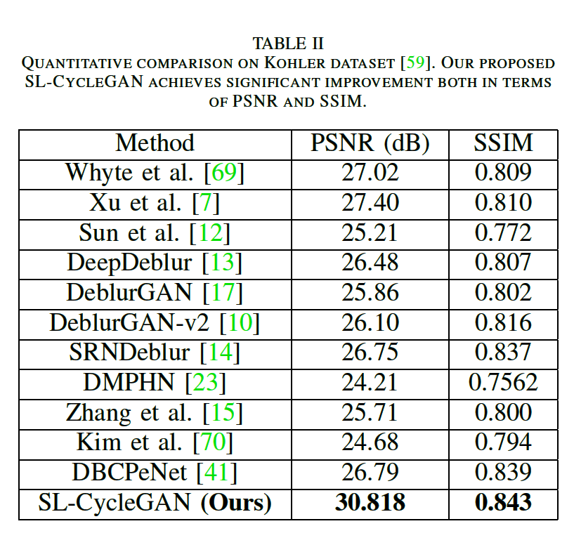
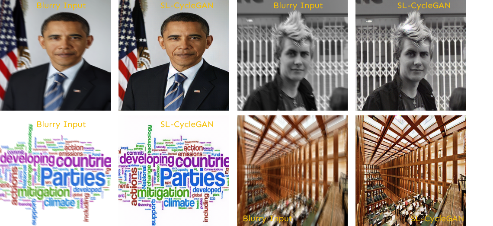
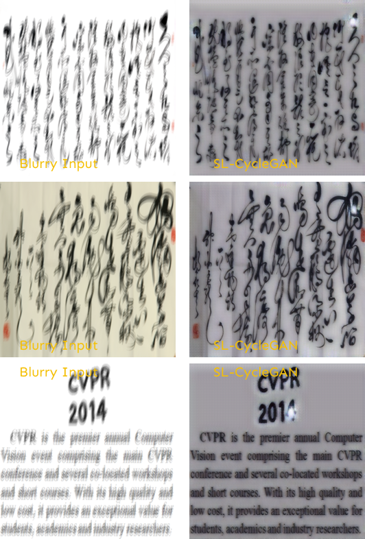
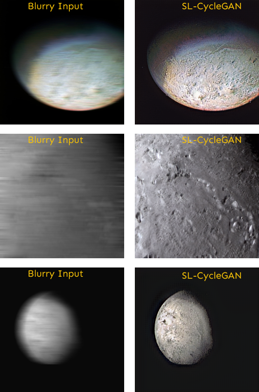

# SL-CycleGAN-Blind-Motion-Deblurring-in-Cycles-using-Sparse-Learning (2022)
[](https://arxiv.org/abs/2111.04026)
 
 Ali Syed Saqlain<sup>1</sup>, Li Yun Wang<sup>2</sup>, & Fang Fang<sup>1</sup>
 <br/>
 <sup>1 </sup>North China Electric Power University, Beijing
 <br/>
 <sup>2 </sup>Portland State University, USA
 
## Abstract
In this paper, we introduce an end-to-end generative adversarial network (GAN) based on sparse learning for single image motion deblurring, which we called SL-CycleGAN. For the first time in image motion deblurring, we propose a sparse ResNet-block as a combination of sparse convolution layers and a trainable spatial pooler k-winner based on HTM (Hierarchical Temporal Memory) to replace non-linearity such as ReLU in the ResNet-block of SL-CycleGAN generators. Furthermore, we take our inspiration from the domain-to-domain translation ability of the CycleGAN, and we show that image deblurring can be cycle-consistent while achieving the best qualitative results. Finally, we perform extensive experiments on popular image benchmarks both qualitatively and quantitatively and achieve the highest PSNR of 38.087 dB on GoPro dataset, which is 5.377 dB better than the most recent deblurring method.
## Network Architecture 

## Results
### GoPro Dataset 

Deblurring results on GoPro test images
<p align="center"></p>


<p align="center"></p>


### Kohler Dataset

Deblurring results on Kohler test images using pre-trained model 




### Lai Dataset

Deblurring results on Lai test images via pre-trained model 


### Test images from Pan et al 

Blind deblurring results on images from (Pan et al.) via pre-trained model. The GT images weren't fed to the network only the blurry inputs 



### Deblurring Neptune's satellite Triton 

Test images 



<br/>

## Citation
If you find this work is useful for your research, please cite our paper:

```
@article{saqlain2021sl,
  title={SL-CycleGAN: Blind Motion Deblurring in Cycles using Sparse Learning},
  author={Saqlain, Ali Syed and Wang, Li-Yun and Fang, Fang},
  journal={arXiv preprint arXiv:2111.04026},
  year={2021}
}
```

<br/>


